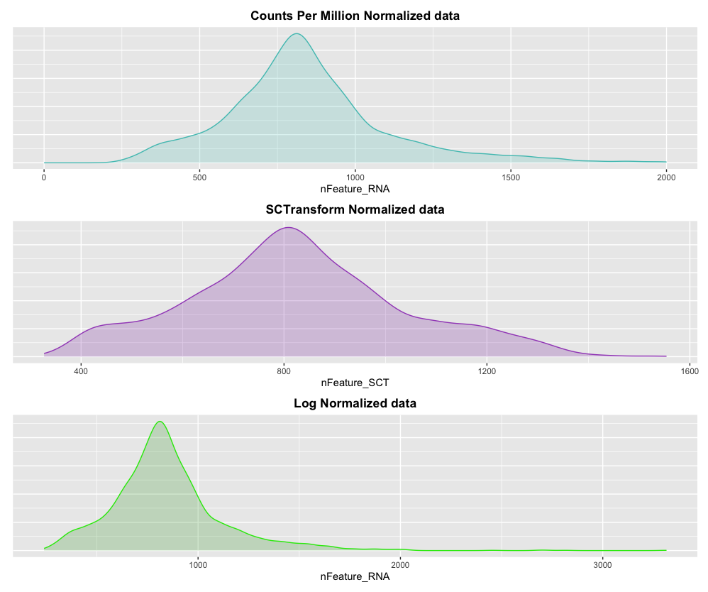

# autoSClust

## Description
Deploy the scRNA sequencing data analysis pipeline for downstream cell level and gene level expression analysis. This package is meant to accommodate a broad range of scRNA-seq data types and output visual aides so users can quickly determine the best method according to the nature of the dataset.
## Instalation
To install the latest version of the package:
``` r
require("devtools")
devtools::install_github("coldpeach2/autoSClust", build_vignettes = TRUE) 
library("autoSClust")
```
To run the shinyApp:
```r
runAutoSClust()
```

## Overview
``` r
ls("package:autoSClust")
      browseVignettes("autoSClust")
```
## Contributions
autoSClust currently consists of 4 functions that facilitate scRNA-seq data analysis and visualization.

The first function `runPreProcess` converts the counts matrix outputs from CellRanger into a Seurat object. Then performs the first pre-processing steps including filtering out genes with insignificant gene expression. The user has the option to select which metric they would like to filter out the dataset according to the percentage of mitochondrial genes, ribosomal or dissosiation genes. Violin plots and scatter plots will returned with the filtered dataset for visualization.

The second function `runNormalization` will take in user defined input from 3 different choices of normalization techniques; SCTransform, Counts per Million and LogNorm. The corresponding graph for the normalization method will be output for visualization purposes, if the user selects "all", one can compare which normalization techniques are the best of the three methods.

Next, `runClust` will take in the three objects and performs the necessary preparations for clustering. Seurat's `FindVariableFeatures` function will be called, followed by `ScaleData`, `RunPCA`, `FindNeighbours` and `FindClusters`. The user will be able to see the results in a Dim plot according to either PCA or UMAP reductions.

Finally, the function `computeMetrics` will compute the Dunn index of the clustering output. The Dunn index is a ratio that assesses the correction of clusters and is a metric that measures the smallest distance between observations not in the same cluster to the largest intra-cluster distance.

Example:



## Tutorials
Sample data sets from CellRanger outputs can be found <a href="https://cf.10xgenomics.com/samples/cell/pbmc3k/pbmc3k_filtered_gene_bc_matrices.tar.gz">here</a>. Please download the dataset before proceeding to the vignette. 


## References
1. Hao and Hao et al. Integrated analysis of multimodal single-cell data. Cell (2021) https://doi.org/10.1016/j.cell.2021.04.048
2. F. Grandi, J. Caroli, O. Romano, M. Marchionni, M. Forcato, S. Bicciato, popsicleR: a R Package for pre-processing and quality       control analysis of single cell RNA-seq data, Journal of Molecular Biology (2022), doi: 10.1016/j.jmb.2022.167560 
3. Brock, G., Pihur, V., Datta, S., & Datta, S. (2008). clValid: An R Package for Cluster Validation. Journal of Statistical            Software, 25(4), 1–22. https://doi.org/10.18637/jss.v025.i04

## Acknowledgements
This package was developed for BCB410H: Applied Bioinformatics, University of Toronto, Toronto, CANADA, 2022.
Thank you to cindy fang whoes project I refereced: https://github.com/cindyfang70/clustREval
